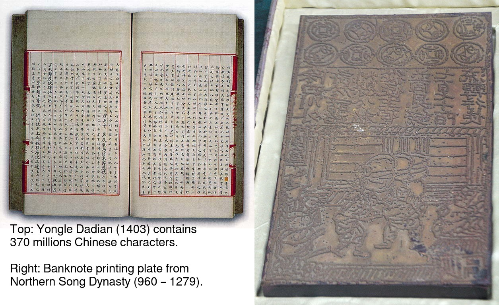

Introduction
============

The usual presentation of research work
---------------------------------------

> An article about computational science in a scientific publication is
> **not** the scholarship itself, it is merely **advertising** of the
> scholarship. The actual scholarship is the complete software
> development environment and the complete set of instructions which
> generated the figures.

\vspace{0.2cm}

Thoughts of Jon Claerbout \"distilled\" by Buckheit & Donoho (1995).

What do we do as manuscript \"producers\"?
------------------------------------------

The preparation of manuscripts and reports in experimental or
computational neuroscience often involves:

-   Doing the experiments or coding and doing the simulations.
-   A lot of data analysis.
-   Careful design and realization of figures and tables.

Simulations involve:

-   Algorithmic choices.
-   Software choices or implementation.
-   Parameters setting (*e.g.*, the time step used for conductance based
    neuronal models).

Data analysis involves:

-   Some data \"preprocessing\" (often).
-   The development of dedicated scripts, routines and codes.
-   Setting some critical parameters.

What would we like as manuscript \"readers\"?
---------------------------------------------

As readers or referees of articles / manuscripts we are therefore often
led to ask questions like:

-   What would happen to the analysis (or simulation) results if a given
    parameter had another value?
-   What would be the effect of applying my preprocessing to the data
    instead of the one used by the authors?
-   What would a given figure look like with a log scale ordinate
    instead of the linear scale use by the authors?
-   What would be the result of applying that same analysis to my own
    data set ?

We can of course all think of a dozen of similar questions.

1.  Notes

    The problem is to find a way to address them. Clearly the classical
    journal article format cannot do the job. Editors cannot publish two
    versions of each figure to satisfy different readers. Many intricate
    analysis and modeling methods would require too long a description
    to fit the usual bounds of the printed paper. This is reasonable for
    we all have a lot of different things to do and we cannot afford to
    systematically look at every piece of work as thoroughly as
    suggested above. Many people (Claerbout & Karrenbach, 1992; Buckheit
    and Donoho, 1995; Rossini & Leisch, 2003; Baggerly, 2010; Diggle &
    Zeger, 2010; Stein, 2011) feel nevertheless uncomfortable with the
    present way of diffusing scientific information as a canonical
    (printed) journal article. We suggest what is needed are more
    systematic and more explicit ways to describe how the analysis (or
    modeling) was done.

The dilemma
-----------

Clearly the classical journal article format cannot do the job.

-   Editors cannot publish two versions of each figure to satisfy
    different readers.
-   Many intricate analysis and modeling methods would require too long
    a description to fit the usual bounds of the printed paper.
-   We all have, moreover, a lot of different things to do and we cannot
    afford to systematically look at every piece of work as thoroughly
    as suggested above.

\vspace{0.1cm}

**We need are more systematic and more explicit ways to describe how the
analysis (or modeling) was done**.

The solution: Reproducible Research
-----------------------------------

**Reproducible Research** (`RR`) or **reproducible data analysis** is an
approach aiming at complementing classical printed scientific articles
with **everything** required to independently reproduce the results they
present.

\vspace{0.25cm}

\"Everything\" covers here:

-   the data,
-   the computer codes,
-   a precise description of how the code was applied to the data.

\vspace{0.25cm}

The \"movement\" started with what Economists have been calling
**replication** since the early eighties to reach what is now called
**reproducible research** in computational data analysis oriented fields
like statistics and signal processing.

What is needed for Reproducible Research?
=========================================

The key \"ingredients\"
-----------------------

In my view:

\vspace{0.25cm}

-   Good note-taking.
-   Tools and tricks making good note-taking \"easy\".
-   Thorough code documentation.
-   \"General\" data formats.
-   Ending with a \"fully algorithmic\" description of the data analysis
    (and simulation).
-   Use software that are likely to still be around 15 to 20 years from
    now.
-   **Use free software**.

Learn from Unix \"philosophy\"
------------------------------

Before looking for the last \"fancy stuff\", try solutions with a
serious record like what Arnold Robins exposes in \"[What\'s
GNU](http://www.linuxjournal.com/article/2762)\":

\vspace{0.25cm}

-   Break down \"complex\" analysis into simple steps (*avoid monolithic
    codes*).
-   Implement each step as a separate program that takes its input from
    the *standard input* (`stdin`) and sends its output to the *standard
    output* (`stdout`); a **filter** in Unix jargon.
-   Try to stick to the **KISS** (Keep It Simple Stupid) approach for
    each program.

Note-taking concerns everyone
=============================

Notes {#notes-1 beamer_env="note"}
-----

This section discusses a much wider issue than *reproducible research*
(RR). Implementing RR requires thorough note-taking and note-taking
concerns everyone. The purpose of this section is therefore to remind
the reader / auditor that he/she already knows: **note-taking concerns
everyone**. Few examples are used to that end.

The scholar annotating his book / manuscript
--------------------------------------------


\vspace{0.25cm}

A XIVth century manuscript with the works of Aristotle owned by Nicasius
de Planca (gallica.bnf.fr / Bibliothèque nationale de France).

1.  Notes

    We see a manuscript from the XIVth century heavily annotated by its
    owner Nicasius de Planca. This kind of note-taking was and remains
    extremely common. You should nevertheless avoid it when reading
    books from a library or from your friends!

    The next two slides show a case of paramount importance for the
    History of Science.

Galileo observing Jupiter\'s moons
----------------------------------


\vspace{0.25cm}

Galileo Galilei\'s notes while observing Jupiter in January 1610 with
his telescope (Wikimedia Commons).

1.  Notes

    The first observation was done on January 7 1610. Galileo Galilei
    first thought that he found new stars close to Jupiter (see the
    [Wikipedia
    page](https://en.wikipedia.org/wiki/Galileo_Galilei#Jupiter's_moons)).
    But after several nights of observation, he realized that these
    \"stars\" were in fact circling around the planet, **they are
    satellites**! He named the group of four the Medicean stars, in
    honour of his future patron, Cosimo II de\' Medici, Grand Duke of
    Tuscany, and Cosimo\'s three brothers (Wikipedia).


\vspace{0.25cm}

The small \"stars\" are in fact orbiting around Jupiter, **they are
doing what the Moon does around the Earth** (Wikimedia Commons).

1.  Notes

    These observations lead Galileo to reject the geocentric hypothesis
    in favor of the heliocentric one. This brought him much later, and
    after a somewhat tortuous path that I don\'t have the space to
    describe now, in front of the Inquisition that sentences him on June
    22 1633 to house arrest, which he remained under for the rest of his
    life.

Placcius and Leibniz closet
---------------------------


\vspace{0.25cm}

Organizing notes Placcius\' way (Placcius, Vincent, 1642-1699. *De arte
excerpendi vom gelahrten Buchhalten*, 1689. Houghton Library, Harvard
University.)

1.  Notes

    With printing appearance, demand for paper increased and paper\'s
    price ended up decreasing (after a large production increase). In
    addition to the use of the *codex* with pages made of paper, many
    scholars started using paper slips.

    But taking abundant notes on paper slips is good only if one can
    find efficiently retrieve this stored information when needed.
    Vincent Placcius (1642-1699) and Gottfried Leibniz (1646-1716) had a
    custom made closet to solve this retrieval problem. This example is
    discussed in Ann Blair\'s book *TOO MUCH TO KNOW*, Yale Univ. Press,
    2010 (pp. 93-95).

1.  

    

2.  

    Zoom on the columns of Paccius\' cabinet. You can see the \"front\"
    (left column), the \"side\" (second from left) and the \"back\"
    (fourth from left).

3.  Notes

    This cabinet had many columns that could rotate about their
    (vertical) axis. The column\'s front was used to write what we would
    now call keywords relating to the content of the notes that were
    hooked on the column\'s back side.

    Notice the advantage of these paper slips over Galileo\'s codex:
    with the former, notes can be reorganized.

Beware of overabundance: Fulgence Tapir\'s disappearance
--------------------------------------------------------

1.  

    

2.  

    In 1908, [Anatole
    France](https://en.wikipedia.org/wiki/Anatole_France) (1844-1924)
    published \"[Penguin
    Island](https://archive.org/stream/in.ernet.dli.2015.220207/2015.220207.Penguin-Island_djvu.txt)\"
    a parody of French history.

    By Photographer : Wilhelm Benque. Tucker Collection - New York
    Public Library Archives, Public Domain,
    <https://commons.wikimedia.org/w/index.php?curid=16240632>.

3.  Notes

    The text can be found *legally* at several places, the [Project
    Gutenberg](https://en.wikipedia.org/wiki/Project_Gutenberg) one is
    missing the \"Preface\", so don\'t use it, go to one of the versions
    available on [Internet
    Archive](https://archive.org/search.php?query=title%3Apenguin%20island%20AND%20-contributor%3Agutenberg%20AND%20mediatype%3Atexts).
    The importance of the preface in illustrated by the following two
    quotations:

    > One word more if you want your book to be well received, lose no
    > opportunity for exalting the virtues on which society is based ---
    > attachment to wealth, pious senti- ments, and especially
    > resignation on the part of the poor, which latter is the very
    > foundation of order. Proclaim, sir, that the origins of property
    > --- nobility and police --- are treat- ed in your history with the
    > respect which these institutions deserve. Make it known that you
    > admit the supernatural when it presents itself. On these
    > conditions you will succeed in good society.

    And more importantly for our present subject:

    > The idea occurred to me, in the month of June last year, to go and
    > consult on the origins and progress of Penguin art, the
    > lamented M. Fulgence Tapir, the learned author of the 'Universal
    > Annals of Painting, Sculpture and Architecture'
    >
    > Having been shown into his study, I found seated before a roll-top
    > desk, beneath a frightful mass of papers, an amaz- ingly
    > short-sighted little man whose eyelids blinked behind his
    > gold-mounted spectacles.
    >
    > To make up for the defect of his eyes his long and mobile nose,
    > endowed with an exquisite sense of touch, explored the sensible
    > world. By means of this organ Fulgence Tapir put himself in
    > contact with art and beauty. It is observed that in France, as a
    > general rule, musical critics are deaf and art critics are blind.
    > This allows them the collectedness neces- sary for æsthetic ideas.
    > Do you imagine that with eyes capable of perceiving the forms and
    > colours with which mysterious nature envelops herself, Fulgence
    > Tapir would have raised himself, on a mountain of printed and
    > manuscript docu- ments, to the summit of doctrinal spiritualism,
    > or that he would have conceived that mighty theory which makes the
    > arts of all tunes and countries converge towards the Institute of
    > France, their supreme end?
    >
    > The walls of the study, the floor, and even the ceiling were
    > loaded with overflowing bundles, pasteboard boxes swollen beyond
    > measure, boxes in which were compressed an in- numerable multitude
    > of small cards covered with writing. I beheld in admiration minted
    > with terror the cataracts of erudition that threatened to burst
    > forth.
    >
    > 'Master,' said I in feeling tones, 'I throw myself upon your
    > kindness and your knowledge, both of which are inexhaustible.
    > Would you consent to guide me in my arduous researches into the
    > origins of Penguin art?'
    >
    > 'Sir,' answered the Master, 'I possess all art, you under- stand
    > me, all art, on cards classed alphabetically and in order of
    > subjects. I consider it my duty to place at your dis- posal all
    > that relates to the Penguins. Get on that ladder and take out that
    > box you see above. You will find in it every- thing you require.'
    >
    > I tremblingly obeyed. But scarcely had I opened the fatal box than
    > some blue cards escaped from it, and slipping through my fingers,
    > began to rain down. Almost immediate- ly, acting in sympathy, the
    > neighbouring boxes opened, and there flowed streams of pink,
    > green, and white cards, and by degrees, from all the boxes,
    > differently coloured cards were poured out murmuring like a
    > waterfall on a mountain side in April. In a minute they covered
    > the floor with a thick layer of paper. Issuing from their
    > inexhaustible reservoirs with a roar that continually grew in
    > force, each second in- creased the vehemence of their torrential
    > fall. Swamped up to the knees in cards, Fulgence Tapir observed
    > the cataclysm with attentive nose. He recognised its cause and
    > grew pale with fright
    >
    > 'What a mass of art !' he exclaimed.
    >
    > I called to him and leaned forward to help him mount the ladder
    > which bent under the shower. It was too late. Over- whelmed,
    > desperate, pitiable, his velvet smoking-cap and his gold-mounted
    > spectacles having fallen from him, he vainly opposed his short
    > arms to the flood which had now mounted to his arm-pits. Suddenly
    > a terrible spurt of cards arose and enveloped him in a gigantic
    > whirlpool. During the space of a second I could see in the gulf
    > the shining skull and little fat hands of the scholar, then it
    > closed up and the deluge kept on pouring over what was silence and
    > immobility. In dread lest I in my turn should be swallowed up
    > ladder and all I maae my escape through the topmost pane of the
    > window.

A sailor\'s logbook
-------------------

[./imgs/LivredebordpenduickV.JPG](./imgs/LivredebordpenduickV.JPG)

\vspace{0.25cm}

The logbook of Eric Tabarly during the San-Francisco / Tokyo
transpacific ocean race in 1969.

1.  Notes

    This example is only superficially anecdotal. Information about the
    source can be found at:
    <https://commons.wikimedia.org/wiki/File:LivredebordpenduickV.JPG>.

 {#section-6}


\vspace{0.25cm}

On the left side, Tabarly reports salient events like a ripped jib on
March 21 at 11 pm.

 {#section-7}


\vspace{0.25cm}

On the right side, he computes his position (that was before GPS time!).

1.  Notes

    This example is only superficially anecdotal. Ten years ago, a
    European project was aiming at estimating the Atlantic and Indian
    Oceans climates during the 18th century using logbooks from ships of
    the West- and East-India companies from the Kingdoms of Portugal,
    Spain, Holland, Britain and France. See the [Climatological Database
    for the World\'s Oceans 1750-1850](http://webs.ucm.es/info/cliwoc/).

    In the same vein, logbooks from slave ships give a lot of
    quantitative information about the slave trade between Africa and
    the \"New World\".

So, what should we use to take notes?
-------------------------------------

-   The object of study (like the annotated book)?
-   One or several notebooks?
-   Paper slips or cards?
-   Computer files?
-   Drawings, Pictures?
-   Films?
-   ...?

Avoid getting lost
------------------

Notes generate an organizational problem:

\vspace{0.25cm}

-   How can we structure our notes?
-   Can we index them, if yes, how?
-   How can we archive them while keeping the capability to make them
    evolve?

1.  Notes

    Notes are necessarily heterogeneous---because of their subject
    matter as well as, often, their material support---and that creates
    a **serious** organizational problem.

    **Without organization, notes usability barely exceeds our
    capability of memorizing facts and events**.

    In the sequel we are going to give *tentative* answers to the
    questions raised in the last two slides.

Note-taking: a quick History
============================

Since note-taking concerns everyone...
--------------------------------------

-   Since we are all \"note-takers\", our predecessors were also
    note-takers.
-   This elementary observation will lead us to \"study\" how our
    brilliant ancestors took notes.
-   Hopefully, we can learn some useful techniques on the way and put
    them on daily use.
-   Hopefully, we can avoid thinking that we are the first to face the
    kind of problem we are now facing: \"information overload\".

What are we going to talk about?
--------------------------------

-   The practical aspect of note-taking---what Historians dub
    \"materiality\"---.
-   The books and notes organization.
-   The link between the concrete and organizational aspects.

\vspace{0.2cm}

We are going to discuss a lot books organization since the \"navigation
devices\" designed for the latter:

-   table of content,
-   index,
-   etc,

also applies to notes.

1.  Clarification

    We will mostly refer to the \"Western\" part of this History, with a
    single slide on Chinese contributions and nothing on Muslim, Indian
    or pre-Colombian contributions. This bias must be clearly understood
    as a **reflection of my ignorance** (I\'m actively learning on the
    subject) and because it\'s easier, as always, to find illustrative
    material for \"Western\" contributions...

The concrete aspects summarized on a single slide
-------------------------------------------------


1.  Details

    All illustrations are taken from Wikimedia Commons

    -   Top left: A clay tablet (pre-cuneiform period, -3000).
    -   Top center: A fresco from Pompeii with the portrait of
        [Terentius Neo and his
        wife](https://en.wikipedia.org/wiki/Portrait_of_Paquius_Proculo).
        She carries a [wax
        tablet](https://en.wikipedia.org/wiki/Wax_tablet) and a *stylus*
        (the main medium of note-takers up to the 19th century); he
        carries a *volumen* or
        [scroll](https://en.wikipedia.org/wiki/History_of_scrolls), the
        stuff of books until the beginning of the Common Era.
    -   Top right: a notebook made of paper from the 17th century with
        [commonplaces](https://en.wikipedia.org/wiki/Commonplace_book).
        \"Commonplace\" is a translation of the Latin term locus
        communis (from Greek tópos koinós, see literary topos) which
        means \"a theme or argument of general application\", such as a
        statement of proverbial wisdom (Wikipedia).
    -   Bottom left: An [index
        card](https://en.wikipedia.org/wiki/Index_card), a notes medium
        whose use exploded with bureaucratization and the development of
        libraries. Still heavily used in the humanities. Apparently
        first used (if not created) by the father of taxonomy, [Carl
        Linneaus](https://en.wikipedia.org/wiki/Carl_Linnaeus). You can
        find his cards at: <http://linnean-online.org/61332/#/0>.
    -   Bottom center: A [Post-it
        note](https://en.wikipedia.org/wiki/Post-it_note) as most of us
        use every day.
    -   Bottom right: A \"modern days\" numerical tablet.

    The code generating the figure:

    ``` {#Making-concrete-summary-of-material aspect .shell results="hide"}
    # This requires imagemagick
    cd imgs 
    wget https://upload.wikimedia.org/wikipedia/commons/thumb/e/e2/Clay_Tablet_-_Louvre_-_AO29562.jpg/1024px-Clay_Tablet_-_Louvre_-_AO29562.jpg -O Tablette_argile.jpg 
    wget https://upload.wikimedia.org/wikipedia/commons/thumb/8/85/Meister_des_Portr%C3%A4ts_des_Paquius_Proculus_001.jpg/651px-Meister_des_Portr%C3%A4ts_des_Paquius_Proculus_001.jpg -O Proculus.jpg 
    wget https://upload.wikimedia.org/wikipedia/commons/thumb/5/50/Commonplace_book_mid_17th_century.jpg/878px-Commonplace_book_mid_17th_century.jpg -O Carnet.jpg 
    wget https://upload.wikimedia.org/wikipedia/commons/6/6e/Lhfhospitalsstatehospital001.jpg -O Carte.jpg 
    wget https://upload.wikimedia.org/wikipedia/commons/e/ef/Fait_cnv.jpg -O Post_it.jpg 
    wget https://upload.wikimedia.org/wikipedia/commons/thumb/d/da/Lenovo_Yoga_3_Pro.jpg/1024px-Lenovo_Yoga_3_Pro.jpg -O Tablette_ordi.jpg 
    montage -mode concatenate -tile 3x2 Tablette_argile.jpg Proculus.jpg Carnet.jpg Carte.jpg Post_it.jpg Tablette_ordi.jpg Figure_W1_S2_1.jpg
    rm Tablette_argile.jpg Proculus.jpg Carnet.jpg Carte.jpg Post_it.jpg Tablette_ordi.jpg
    ```

Wax tablet and stylus
---------------------


1.  Details

    From the [Wikipedia page](https://en.wikipedia.org/wiki/Wax_tablet):

    A wax tablet is a tablet made of wood and covered with a layer of
    wax, often linked loosely to a cover tablet, as a \"double-leaved\"
    diptych. It was used as a reusable and portable writing surface in
    Antiquity and throughout the Middle Ages.

    Writing on the wax surface was performed with a pointed instrument,
    a stylus. Writing by engraving in wax required the application of
    much more pressure and traction than would be necessary with ink on
    parchment or papyrus,\[1\] and the scribe had to lift the stylus in
    order to change the direction of the stroke. Therefore, the stylus
    could not be applied with the same degree of dexterity as a pen. A
    straight-edged, spatula-like implement (often placed on the opposite
    end of the stylus tip) would be used in a razor-like fashion to
    serve as an eraser. The entire tablet could be erased for reuse by
    warming it to about 50 °C and smoothing the softened wax surface.
    The modern expression of \"a clean slate\" equates to the Latin
    expression \"tabula rasa\".

From the *scroll* to the *codex*
--------------------------------


1.  Details

    The shift from the *scroll* to the *codex* is fundamental for
    development of written civilization.

    A scroll (from the Old French escroe or escroue), is a roll of
    papyrus, [parchment](https://en.wikipedia.org/wiki/Parchment), or
    paper containing writing.

    From
    [Wikipedia](https://en.wikipedia.org/wiki/History_of_scrolls#Replacement_by_the_Codex):

    The codex was a new format for reading the written word, consisting
    of individual pages loosely attached to each other at one side and
    bound with boards or cloth. It came to replace the scroll thanks to
    several problems that limited the scroll\'s function and
    readability. For one, scrolls were very long, sometimes as long as
    ten meters. This made them hard to hold open and read, a difficulty
    not helped by the fact that most scrolls in that era were read
    horizontally, instead of vertically as scrolling virtual documents
    are read now. The text on a scroll was continuous, without page
    breaks, which made indexing and bookmarking impossible. Conversely,
    the codex was easier to hold open, separate pages made it possible
    to index sections and mark a page, and the protective covers kept
    the fragile pages intact better than scrolls generally stayed. This
    last made it particularly attractive for important religious texts.

    The bottom left mosaic shows Virgil seating (70-19 BCE) holding a
    scroll of the *Aeneid*, with Clio, muse of history, also holding a
    scroll.

    As explained by Frédéric Barbier (*Histoire du Livre*): \"The scroll
    / volumen imposes a complex reading practice: one must unroll
    (*explicare*) and roll at the same time; that forbids working on
    several scrolls (the original text and its commentary) at the same
    time or to take notes. It imposes a continuous reading and making
    consultation impossible.\"

    Scrolls are clearly unsuited to \"nomadic reading\"; can you imagine
    Ulysses embarking for his Odyssey carrying the 24 scrolls/volumen of
    the Iliad?

    The term *volumen* is the origin of our modern *volumes* (a book in
    several volumes) as of the word for the geometrical concept.

    Switching from scroll to codices required two innovations:

    -   The collection of wax tablets bound together with leather
        strands.
    -   The generalization of
        [parchment](https://en.wikipedia.org/wiki/Parchment) (usually
        sheep skin specially processed) as a replacement for
        [papyrus](https://en.wikipedia.org/wiki/Papyrus). This
        generalization could be due (according to Pliny the Elder) to a
        rivalry between the cities of Pergamon and Alexandria for
        cultural hegemony: [Ptolemy V
        Epiphanes](https://en.wikipedia.org/wiki/Ptolemy_V_Epiphanes)
        King of Egypt wanted to block [Eumenes
        II](https://en.wikipedia.org/wiki/Eumenes_II) from developing in
        Pergamon a library that could compete with the one of
        Alexandria; he therefore imposed an embargo on papyrus export
        (Egypt was the sole papyrus producer). Eumenes looked for an
        alternative and fostered parchment development. The link between
        Pergamon and parchment is much clearer in German where Pergamon
        is written in the way as in English but where parchment is
        written *Pergament*.

    Switching from scrolls to codices will have major consequences on
    books organization as well as on the reading practices, it will
    later on allow printing development.

    The main revolution brought by the codex is the *page*. Thanks to
    this structural element, the reader can access directly to a
    specific chapter or a specific part of the text, while scrolls
    imposed continuous reading **at a time when there were no blanks
    between words**. According to Collette Sirat: \"Twenty centuries
    will be necessary to realize the paramount importance of the codex
    for our civilization through the **selective reading** it made
    possible as opposed to the continuous reading. It opened room for
    the elaboration of mental structures where the text is dissociated
    from the speech and its rythm.\"

    Notice the red letters used on the codex (bottom right), an example
    of [rubrication](https://en.wikipedia.org/wiki/Rubrication) used by
    scribes to mark paragraphs. With printing and the high cost of
    colors it entailed, an empty space started to be used to that end.
    Thinking about it, colors don\'t cost anything on a numerical
    support and could perfectly be used again in the same way.

Eusebius and the invention of cross-references
----------------------------------------------


1.  Details

    Illustrations from Wikimedia Commons. The code generating the
    figure:

    ``` {.bash org-language="sh" results="silent"}
    cd imgs 
    wget https://upload.wikimedia.org/wikipedia/commons/b/ba/Eusebius_of_Caesarea.jpg 
    wget https://upload.wikimedia.org/wikipedia/commons/1/1f/Romia_Imperio.png 
    convert Romia_Imperio.png Eusebius_of_Caesarea.jpg -gravity northeast -composite Eusebius.jpg 
    convert Eusebius.jpg -font FreeSans -pointsize 75 -gravity southwest -annotate 0 'Roman Empire' Eusebius_leg.jpg 
    convert Eusebius_leg.jpg -font FreeSans -pointsize 75 -annotate +700+75 'Eusebius of\nCaeserea\n(265-340)' Eusebius_leg2.jpg 
    convert Eusebius_leg2.jpg -font FreeSans -pointsize 30 -annotate +1150+900 'Caeserea' Eusebius_final.jpg 
    rm Romia_Imperio.png Eusebius_of_Caesarea.jpg Eusebius.jpg Eusebius_leg.jpg Eusebius_leg2.jpg
    ```

    From the Wikipedia page on
    [Eusebius](https://en.wikipedia.org/wiki/Eusebius):

    > Eusebius of Caesarea (ad 260/265 -- 339/340), also known as
    > Eusebius Pamphili, was a historian of Christianity, exegete, and
    > Christian polemicist. He became the bishop of Caesarea Maritima
    > about 314 AD. Together with Pamphilus, he was a scholar of the
    > Biblical canon and is regarded as an extremely learned Christian
    > of his time. He wrote Demonstrations of the Gospel, Preparations
    > for the Gospel, and On Discrepancies between the Gospels, studies
    > of the Biblical text.

    According to Anthony Grafton and Megan Williams (2006) *Christianity
    and the Transformation of the Book*, The Belknap Press of Harvard
    University Press, his writings are crucial for our knowledge of the
    first three centuries of Christian history. *He brought several
    essential innovations to the book\'s organization like the
    cross-references*.

Eusebian canons
---------------


\vspace{0.2cm}

Fol. 10v and 11r of the Egmond Gospels. Canon tables (900 CE).

1.  Details

    Source:
    <https://commons.wikimedia.org/wiki/File:Fol._10v-11r_Egmond_Gospels.jpg>.
    Public Domain. The code generating the figure:

    ``` {.bash org-language="sh" results="silent"}
    cd imgs
    wget https://upload.wikimedia.org/wikipedia/commons/0/0e/Fol._10v-11r_Egmond_Gospels.jpg
    ```

    Quote from
    [Wikipedia](https://en.wikipedia.org/wiki/Eusebius#Biblical_text_criticism):

    > For an easier survey of the material of the four Evangelists,
    > Eusebius divided his edition of the New Testament into paragraphs
    > and provided it with a synoptical table so that it might be easier
    > to find the pericopes that belong together. These canon tables or
    > \"Eusebian canons\" remained in use throughout the Middle Ages,
    > and illuminated manuscript versions are important for the study of
    > early medieval art, as they are the most elaborately decorated
    > pages of many Gospel books.

*Codex* significance
--------------------

Following Frédéric Barbier (*HISTOIRE DU LIVRE*, Armand Colin, 2009):

-   *Codex* invention is crucial for the development of written
    civilization.
-   The *codex* lends itself to **consultation reading**.
-   We can add to the *codex* a \"navigation system\" making
    consultation easier.
-   We can take notes while consulting a *codex*.
-   The combination of the *codex* with the *Carolingian minuscule*
    constitutes an extremely powerful intellectual tools, never seen
    before.

1.  Details

    Example of *Carolingian minuscule* can be found on the corresponding
    [Wikipedia
    page](https://en.wikipedia.org/wiki/Carolingian_minuscule).

    Over centuries, *codices*---that we often call *manuscripts*---will
    slowly evolve and gain modern days book attributes:

    -   separation between words (VIIth century),
    -   start of punctuation (VIIIth century),
    -   table of content,
    -   running title,
    -   paragraph marks (rubrication, XIth century),
    -   pagination,
    -   index (XIIIth century).

    An interesting point: Torah\'s content got \"fixed\" before the
    *codex* generalization and today Torah scrolls are still used.

Let us not forget China
-----------------------



1.  Details

    The link between the *codex* generalization, on the one hand, and
    the apparition of \"navigation guides\" like the table of content,
    the index, the running title, on the other hand as a counterpart in
    the Chinese civilization.

    In China, competitive examinations to become a high ranking state
    employee developed in the IXth century (CE). The main part of these
    exam was a paper on what we would now call general knowledge of the
    Classics where the students were asked to demonstrate their
    knowledge through appropriate quotations.

    To fulfill the need of \"textbook\" appropriate for this kind of
    examination what is called
    [leishus](https://en.wikipedia.org/wiki/Leishu) were produced. They
    are described as follows on Wikipedia:

    > The leishu are composed of sometimes lengthy citations from other
    > works and often contain copies of entire works, not just excerpts.
    > The works are classified by a systematic set of categories, which
    > are further divided into subcategories. Leishu may be considered
    > anthologies, but are encyclopedic in the sense that they may
    > comprise the entire realm of knowledge at the time of compilation.

    The efficient use of the leishu requires an indexing system, a table
    of content, etc. Very interestingly, the scroll will be abandoned
    and the codex will generalize in China around that time, as observed
    by Ann Blair in her book *TOO MUCH TO KNOW*, Yale Univ. Press, 2010
    (pp. 28-31).

    Most of the leishus **were printed** (from the IXth century on!).
    The picture on the right side (a banknote printing plate) is there
    to remind us of who was (by far) the most advanced at that time. The
    Chinese were of course printing their leishus on paper that they
    discovered in the VIIIth century BCE.

    The code generating the figure:

    ``` {.bash org-language="sh" results="silent"}
    cd imgs
    wget https://upload.wikimedia.org/wikipedia/commons/e/e5/Yongle_Dadian_Encyclopedia_1403.jpg
    wget https://upload.wikimedia.org/wikipedia/commons/thumb/a/aa/Beijing.China_printing_museum.Plate_of_Paper_money.Northern_Song_Dynasty.jpg/615px-Beijing.China_printing_museum.Plate_of_Paper_money.Northern_Song_Dynasty.jpg -O Matrice_billet_song.jpg
    convert Yongle_Dadian_Encyclopedia_1403.jpg Matrice_billet_song.jpg +append -font FreeSans -pointsize 30 -gravity southwest -annotate +25-150 "Top: Yongle Dadian (1403) contains\n370 millions Chinese characters.\n\nRight: Banknote printing plate from\nNorthern Song Dynasty (960 – 1279)." Figure_W1_S2_6.jpg
    rm Yongle_Dadian_Encyclopedia_1403.jpg Matrice_billet_song.jpg
    ```

Getting organized by using the right slot
-----------------------------------------


\vspace{0.25cm}

Placcius\' closet again (Placcius, Vincent, 1642-1699. *De arte
excerpendi vom gelahrten Buchhalten*, 1689. Houghton Library, Harvard
University.)

1.  Details

    Now that we briefly reviewed the timeline of the main navigation
    elements of the books---navigation elements that can of course be
    applied to our lab/note-books---we come back to the paper slips and
    cards as notes media.

    We see (again) Placcius\' and Leibniz\'s closet since it displays
    both the benefits and the shortcomings of media that hold **a single
    note**.

    Obvious shortcomings are:

    -   Paper slips and cards get easily lost.
    -   They are essentially useless if they are not **classified** in
        addition to being filed.

    These problems are solved by Placcius\' cabinet, the content of
    which is fundamentally accessed through the index.

    Clear benefits are:

    -   Paper slips can be easily reorganized when they contain
        information on several subjects.
    -   Paper slips can be directly pasted in a book when composing an
        anthology or a compendium.

    This last technique (pasting when making an anthology) was
    systematically used by the Renaissance polymath [Conrad
    Gessner](https://en.wikipedia.org/wiki/Conrad_Gessner) (1516-1565)
    who even got his paper slips by cutting parts of pages from books
    (don\'t do that with library books)!

Constructing a notebook index the John Locke way
------------------------------------------------


\vspace{0.25cm}

My own notebook is used here for illustration.

1.  Details

    We will now learn about an index construction technique due to [John
    Locke](https://en.wikipedia.org/wiki/John_Locke) (1632-1704), the
    grand-father of liberalism and a major investor in the *Royal
    African Company*, the largest company in the
    [slave-trade](https://en.wikipedia.org/wiki/John_Locke#Constitution_of_Carolina)
    business at that time...

    The indexing method is here illustrated using my own notebook. The
    two pages that are displayed describe the structure of a dataset in
    the [HDF5](https://www.hdfgroup.org/) format on the left side and
    the corresponding structure (designed to map the former one) of a
    `data frame` object of the [R](https://www.r-project.org/) language.
    This dataset contain **calcium** concentration measurements made in
    **neurons**. This notes were taken while writing some computer
    **code** to analyze the data.

    The precise content of the pages does not matter here in order to
    understand how Locke\'s method works. The important points are:

    -   The pages are numbered (we are seeing here pages 86 and 87).
    -   Keywords are written at the bottom of the page: **code**;
        **neuro**; **calcium**.

    This method can be applied after note-taking, you just need to have
    few pages left at the end of your notebook. That\'s in fact what I
    did since I had started filling my notebook before learning about
    the method (I learned about while preparing the French version of
    this lecture last September).

Locke\'s method continued
-------------------------


\vspace{0.25cm}

The last pages of my notebook with the index.

1.  Details

    We now the index. It is located at the end of the notebook although
    Locke recommends placing it at the beginning. Since I did not know
    about the method when I started the notebook, I had to place it at
    the end...

    The idea is to enter the keywords used in the notebook based on
    their **first letter** and the **first vowel following the first
    letter**.

    The index is therefore made of the 26 letters (you see letters \"A\"
    to \"R\" here, the remaining ones are on the next page) subdivided
    the five most common vowels (\"y\" goes together with \"i\" in that
    case).

    Pages 86 and 87 contained the keyword **code** that goes into the
    entry \"Co\" of the index (you see \"86-89\" because the following
    pages also concern code for the same project). The keyword **Neuro**
    giving an entry on line \"Ne\", while the keyword **Calcium** gives
    an entry on line \"Ca\".

    The keyword **Criquet** (not shown above) gives an entry on line
    \"Ci\".

    It is also a good idea to list the set of keywords used in the
    notebook on the page preceding or following the index.

Conclusions of the historical overview
--------------------------------------

Since it is hard (for me at least) to use paper as a medium for
note-taking, learning from \"Newton\'s giants\" should save us from
reinventing the wheel (and getting it square).

\vspace{0.25cm}

We should nevertheless use numerical medium as much as possible (while
keeping in mind what we just learned) since it provides:

-   more organizational and structural flexibility,
-   reliable archiving tools,
-   powerful indexing tools.

Form text files to lightweight markup languages
===============================================

Section introduction {#section-introduction beamer_env="note"}
--------------------

We now start the \"technical\" part of this lecture with the tools that
computers provide for note-taking like [text
files](https://en.wikipedia.org/wiki/Text_file) and [lightweight markup
languages](https://en.wikipedia.org/wiki/Lightweight_markup_language).

What is a *text file* or *text format*?
---------------------------------------

-   From a practical viewpoint, a [text
    files](https://en.wikipedia.org/wiki/Text_file) *gives something
    readable* when opened with a [text
    editor](https://en.wikipedia.org/wiki/Text_editor).
-   A [text editor](https://en.wikipedia.org/wiki/Text_editor) enables
    us to create and modify text files (nice circular definition!).
    It\'s a software like:
    -   [Notepad++](https://notepad-plus-plus.org/) for `Windows`,
    -   [gedit](https://wiki.gnome.org/Apps/Gedit) for `Unix/Linux`
        systems (but it also runs on the other two),
    -   [TextEdit](https://en.wikipedia.org/wiki/TextEdit) for `MacOS`.

\vspace{0.2cm}

-   I\'m mentioning only open source software since it is hard to do
    genuinely reproducible research with anything else.
-   A [word precessor](https://en.wikipedia.org/wiki/Word_processor) is
    more sophisticated than a *text editor*.
-   **Warning** the native format used by word processor is rarely a
    *text format*. `Word`\'s `doc` and `docx` files and `Libreoffice`
    `odt` files *are not text files*.

Example of a file that cannot be read with a text editor
--------------------------------------------------------


\vspace{0.25cm}

A `pdf` file (the file shown right now with a pdf reader) opened with
`gedit`.

A text file opened with a text editor
-------------------------------------


\vspace{0.25cm}

A `markdown` file (a source file for this lecture) opened with `gedit`.

Why should we use text files?
-----------------------------

Characters contained in text files are now typically encoded in
[UTF-8](https://en.wikipedia.org/wiki/UTF-8).

\vspace{0.2cm}

**This implies that**:

\vspace{0.2cm}

-   It is \"always\" possible to read these files with a text editor
    *even years after their creation*.
-   [Desktop search](https://en.wikipedia.org/wiki/Desktop_search) and
    [Concurrent Versions
    Systems](https://en.wikipedia.org/wiki/Concurrent_Versions_System)
    (CVS) software work *very efficiently* with them.

\vspace{0.2cm}

**Unless you run into serious memory problems, use text files, always.**

Problems with simple text files
-------------------------------

-   The \"simple\" text file precludes the use of nice navigation tools
    like [hyperlinks](https://en.wikipedia.org/wiki/Hyperlink).
-   It is not possible to emphasize a word with a **bold** or an
    *italic* font.
-   If several persons work on the same text, they can\'t correct each
    other by ~~striking through~~ text.

\vspace{0.2cm}

These limitations, combined to the benefits of text files led computer
scientists to develop [markup
languages](https://en.wikipedia.org/wiki/Markup_language).

A trivial example is the HTML language.
---------------------------------------


\vspace{0.25cm}

Wikipedia [HTML](https://en.wikipedia.org/wiki/HTML) page viewed with
[qutebrowser](http://www.qutebrowser.org/) [web
browser](https://en.wikipedia.org/wiki/Web_browser).

An HTML file opened with a text editor
--------------------------------------


\vspace{0.25cm}

The Wikipedia HTML page opened with `gedit`. Markup languages were not
designed to be read by humans.

1.  Note

    The content of files written with a markup language are typically
    processed by a dedicated software like a web browser or converted
    into a format for which readers are available like LaTeX{} files
    that get \"compiled\" into PDF files.

    If you look carfuly the last figure, you can find the text of the
    first main paragraph of the previous figure.

 {#section-8}

We can summarize our problem as follows:

\vspace{0.2cm}

-   Text files are attractive for note-taking.
-   Markup languages provide a much better \"reading experience\" when
    viewed with the proper \"browser\".
-   Markup language files are text files, **but** require usually a
    dedicated editing software if we want to modify them.

\vspace{0.2cm}

Is it possible to combine the benefits of \"simple\" text files with the
reading comfort of markup languages?

Lightweight markup languages: the idea
--------------------------------------

A [lightweight markup
language](https://en.wikipedia.org/wiki/Lightweight_markup_language) is:

\vspace{0.2cm}

-   A *markup language* with a **simple syntax**.
-   A language designed to be **easily edited** with a *text editor*.
-   A language **easily read** without a browser.

`Markdown`\'s example
---------------------


\vspace{0.25cm}

The syntax basics from
[Wikipedia](https://en.wikipedia.org/wiki/Markdown), see also
\"Mastering Markdown\" (a 3 min read) from
[GitHub](https://guides.github.com/features/mastering-markdown/).

`Markdown` is not the only lightweight markup language
------------------------------------------------------

Among the \"most popular\":

\vspace{0.2cm}

-   [MediaWiki](https://en.wikipedia.org/wiki/MediaWiki#Markup) used by
    Wikipedia (but files are not stored in text format!).
-   [DokuWiki](https://www.dokuwiki.org/dokuwiki#) like `MediaWiki` but
    stored in text format.
-   [reStructuredText](http://docutils.sourceforge.net/rst.html) used
    for the [python](https://www.python.org/) documentation.
-   [AsciiDoc](http://www.methods.co.nz/asciidoc/).
-   [Org mode](https://orgmode.org/), my favorite, but it requires
    learning [emacs](https://www.gnu.org/software/emacs/) (a good thing
    to do, if you have time for it).

\vspace{0.2cm}

The good news is that you don\'t need to be too nervous about choosing
the \"right\" language, thanks to [pandoc](https://pandoc.org/) you can
convert one into any other!

Section\'s summary
------------------

Thanks to lightweight markup languages we will be able to:

\vspace{0.2cm}

-   Work mostly with text files.
-   Write our notes quickly with any editor.
-   Organize our notes.

Notes that are archived but can evolve with version control systems
===================================================================

Introduction of this section
----------------------------

-   The tools we are going to discuss should appeal to a much wider
    audience than the reproducible research community.
-   Anyone working on a text is concerned, even more so when this work
    is done in collaboration.
-   **The longevity issue of notes and texts is in noway new**.
-   The humanists and scholars of the early modern period who
    specialized in text compilations were literally obsessed by this
    problem and used it to justify their work.
-   Their solution was to use multiple copies, as we now do with a
    different medium.
-   We should nevertheless remain humble, the paper (and parchment)
    medium used by humanists as demonstrated its capability to last.
-   When it comes to making notes evolve, I think we can say that some
    real progress was recently made.

The nightmare: changing a text on paper medium
----------------------------------------------

1.  

    

2.  

    Manuscript of *Dangerous Liaisons* (*Les liaisons dangereuses*) by
    Pierre Choderlos de Laclos (p. 258, BNF Gallica).

    There is clearly a very limited number of changes one can bring in
    that way!

Changing a text with a word processor
-------------------------------------


\vspace{0.25cm}

An early version of this lecture (in French) edited with `LibreOffice`.

1.  Details

    We see a way of working in collaboration on a text: most word
    processing software have a way to follow changes brought to the
    text.

    This is not the solution I recommend but this is probably the most
    widely known concurrent version facility.

    Notice the buttons at the bottom left. They appear when you navigate
    in *view* -\> *Toolbars* -\> *track changes*.

    This \"solution\":

    -   is easy to implement,
    -   *does not generate text files*
    -   does not take care of archiving the files.

Making change with a \"wiki engine\"
------------------------------------


\vspace{0.25cm}

The personal wiki (using the
[dokuwiki](https://www.dokuwiki.org/dokuwiki#) engine) I experienced
while preparing the French version of this lecture.

1.  Details

    I started using [dokuwiki](https://www.dokuwiki.org/dokuwiki#) for
    this lecture, it is therefore simple enough to learn.

    `Dokuwiki` uses a test format.

 {#section-11}


\vspace{0.25cm}

Clicking *previous versions* (*anciennes révisions*) gives access to the
list of changes done when and by whom. If I now select two versions...

 {#section-12}


\vspace{0.25cm}

I see the differences between the two versions. You obtain the same
thing on Wikipedia by clicking on *View History*.

Pros and cons
-------------

-   A solution with a strong record for collaborative projects
    (Wikipedia).
-   A text format is used when working with `Dokuwiki`.

\vspace{0.25cm}

-   A single page can be modified at a time.

Version Control Systems
-----------------------

I now come to the most \"sophisticated\" solution:

-   A dedicated software, [git](https://git-scm.com/), is used to manage
    the successive versions of a **set** of files in **different
    formats** (text, images, etc.). In fact files arborizations can be
    managed.
-   `git` like software require a repository, that can be built on the
    user\'s computer, but that is usually on a dedicated server like
    [GitHub](https://github.com/) or [GitLab](https://gitlab.com/).
-   The repository allows several people to work on the same project and
    to exchange their modifications. Each project member has a **full
    copy** of the repository (dating back to his/her last
    *synchronization*).

 {#section-13}


\vspace{0.25cm}

The [GitLab](https://gitlab.com/) interface containing the files of this
presentation.

 {#section-14}


\vspace{0.25cm}

Modifications are easily visualized...
